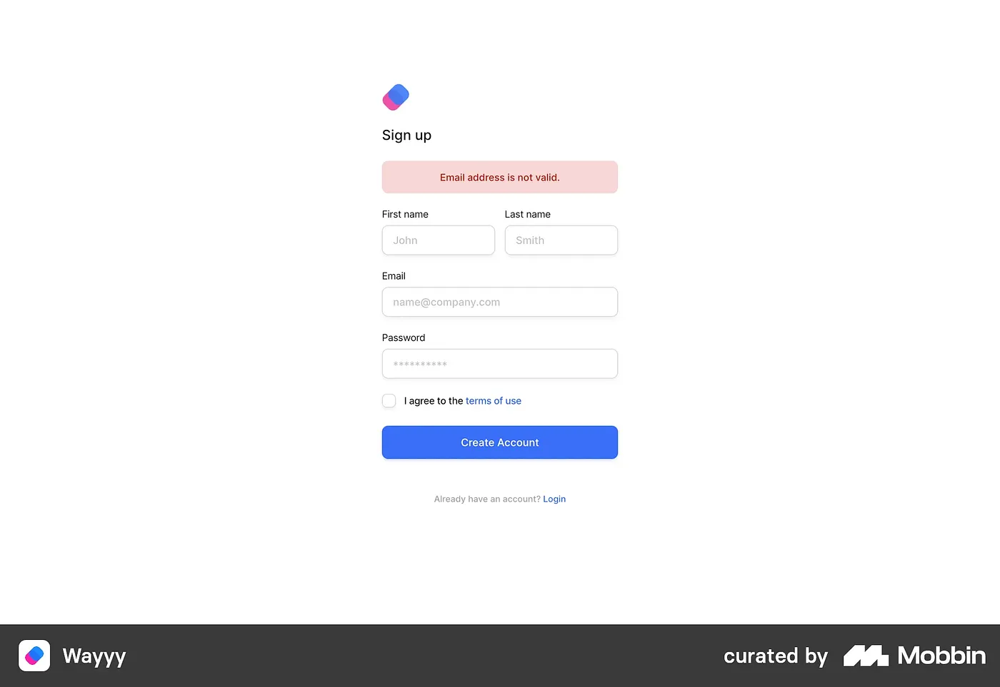
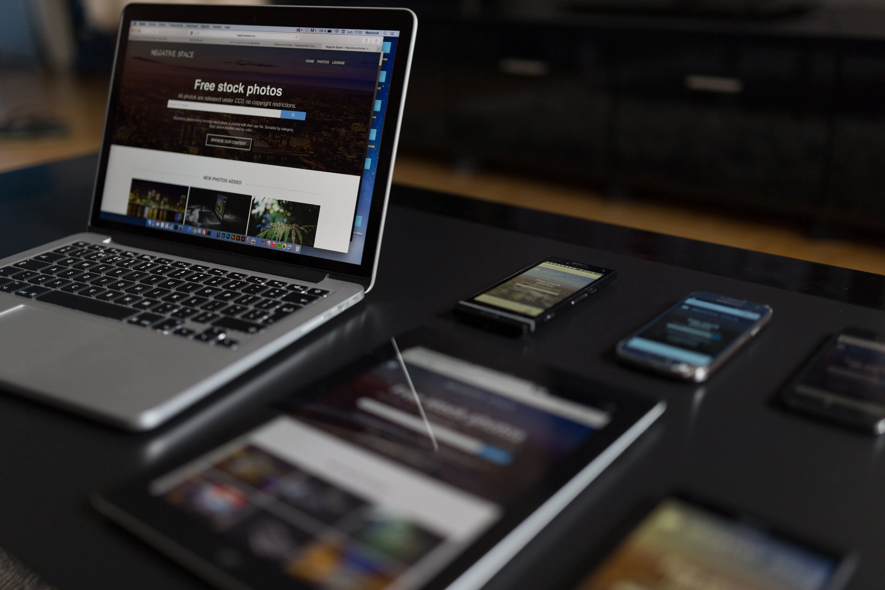

I wish I could have written this sooner, so that those with little to no experience working on real, commercial projects could get a sense of some of the basics of working in product design. Many of these practices might be second-nature to you — if that’s the case, then you’ve got your base covered!

This post isn’t about the theory of design, or about any particular design tool. It’s on how to work better as a designer and more importantly, as part of a design team. Let’s go

---

## #1. Account for every possible scenario and user interaction on an interface

As designers, we often have a tendency to go for the ‘default’ user flow, at least in the beginning stages of a project. A default flow accounts for the experience most users performing that task would encounter in a ‘typical’ scenario, with all parameters and responses along expected lines.

But that’s not what happens in real world. In the real world

* **Loading time:** is not zero (hence loading screens and animations)
* **Errors: Users:** enter wrong inputs in text fields (hence the need for contextually relevant error messages)
* **Abandonment:** Sometimes users tend to discard an action mid-way and want to go back to home as quickly as possible (hence the need for an exit pathway in every step)
* **Missing data:** Sometimes a particular metric/info may not be available for an entity or in a specific context — and that changes the look of the concerned UI element (e.g. a card) , and maybe the position of some other elements.

*Accounting for as many edge cases, errors, interaction scenarios (and their combinations) as possible is a good strategy which ensures that the user experience in all cases is **relevant, predictable, and consistent** . Maybe I would call this the RPC framework.*

## #2. Always preserve previous design iterations — you never know when you’ll need them!

Figma gives you access to previous versions of the file, but it’s good practice to never delete past iterations. You never know when a client or internal stakeholder wants to go back to a previous version to check on some small element or behaviour. In addition, previous designs help **you** assess how far you have come from the first drafts and the rationale behind those decisions.

Having a lot of discarded designs on a page can be confusing — especially if you’re on a free account and limited to 3 pages. It gets easier if you have access to a team account in Figma, because with a team account you can create as many pages as needed, so you can have dedicated pages for trash, wireframes, design system and so on.

How much I wish Figma had the option to lock access to specific pages! Figma — if you’re listening, you know what to do.

## **#3. Not all projects you’ll work on will become portfolio-level case studies.** And that’s okay.

Not every project would involve end-to-end designs from scratch. There would be tasks whether you just need to design a particular page (e.g. a payment failure screen) within a specific section of an app. That’s okay.

Big projects take time, often months, and how you navigate these small problems and details matter quite a bit in the long run.

What this also means is that you need to be comfortable working with the existing designs of other designers. This in turns means that all designers in the team should ideally use a standardised system of  **organisation** , **documentation** and  **communication** . That’s the ODC framework.

## #4. In a client-facing, service-based firm — the client is as important (if not more) as the user.

This is mostly relevant for designers working in a service-based company. You may research multiple references and eventually come up with a design that is functionally and visually better than a previous version, but the client just prefers the design and flow to be a certain way. This is more common than it might seem.

Your job is to provide options and perspective; and try to convince the client to do what’s right for the user. And that’s where it stops. It’s important not to get attached to your designs — the final call rests on the client. And it’s the client who pays your bills. Be cool with that. *Tip to speed up the process: Before starting your own designs from scratch, ask the client if they have any references or ideas in mind.*

Of course if you’re working on something of your own (which is the best thing you can do), these constraints don’t come into play.

## **#5. Save your Styles, Components and Variables from the get go.**

As soon as you begin a project and are past the blank canvas / wireframe stage, start saving all the visual styles (colours, effects, text styles, layouts, borders, etc.) using  **proper names** . *Tip: Do not name components in a context-specific way, e.g. buy cart tabs. The name should generally be agnostic of the usage.*

This helps you save precious time later, because before you realise, ‘ *a few first drafts* ’ can turn into 10 flows and 100 screens. And one thing that’s indispensable to good product design is  **consistency** . Leverage the power of auto-layouts, nested components and variants ***early on*** in the project life cycle to ensure consistency.

## #6. Always be prepared for (inter-designer) hand-offs. Work as if it’s your last day.

Everyone hates hand-offs. I have never once been excited about taking the handoff on another designer’s project. But they are a necessary evil within design teams. And discontinuations and reassignments are not just a design thing — it’s practically everywhere.

As a designer, you can’t control other designers’ work (except trying to set some SOPs on design documentation and organisation, if your team doesn’t have it in place already). But you can do things in a way so that others don’t curse you when you’re handing off your project.

That means being rock solid with organising assets in a structured manner on your design file, codifying and naming them properly, using sections to distinguish flows. Think of everything you hate when you receive someone’e else project file, and eliminate all those pain points.

## #7. Don’t forget to add developer notes.

Product designers, or for that matter anyone involved in building a product, cannot ( *and shouldn’t* ) work in a silo. We have to make it easier for devs to understand the way the product is supposed to look and behave, so that the vision is converted into reality without any loss in fidelity.

You may think that an interface or flow you’ve designed is as intuitive as it can get. But you’ve been working on those designs for quite some time —and this makes your judgement biased. An independent set of eyes may not find them intuitive at all.

Regardless of the level of prototyping you’ve done, it helps to add relevant notes alongside mockup screens to let the developer know what’s expected.

## #8 Responsive design isn’t an afterthought

If you’re designing a desktop screen for a website, think about the responsive version right then and there. At least have a basic idea of how you would go about it. To be one step ahead, leverage the mobile-first design philosophy.

This will help you in coming up with designs that can be (relatively) easily adapted to a smaller viewport, such as that on a tablet or mobile device. I have seen many designers who would design the desktop versions of multiple flows first, and then at the end force fit those designs into a mobile frame. This isn’t optimal, and it also risks leading to a greater dissonance between the two versions. You might also need to do a lot of last-minute changes.

The better way is to design them simultaneously, so that any constraints are identified and accommodated early on.
